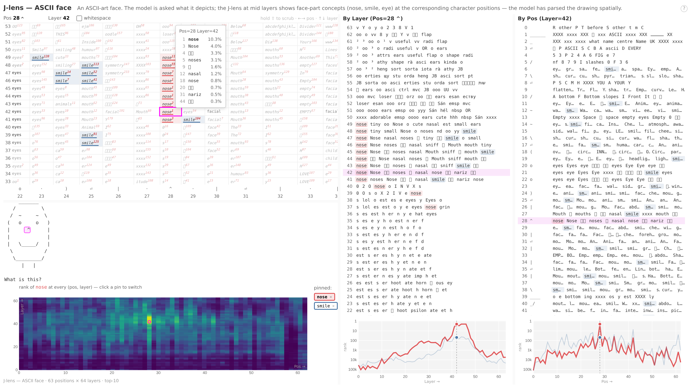

# jlens — Jacobian lens

> **Reference implementation.** Not maintained and not accepting contributions.

Companion code for [**Verbalizable Representations Form a Global Workspace in
Language Models**](https://transformer-circuits.pub/2026/workspace/index.html).

The Jacobian lens reads out what an internal activation is disposed to make the
model say. It linearly transports a residual-stream vector at any layer and
position into the final-layer basis, then decodes it with the model's own
unembedding into a ranked list of vocabulary tokens.

The transport is the average input–output Jacobian over a text corpus:

```
lens_l(h) = unembed( J_l @ h ), J_l = E[∂h_final / ∂h_l]
```

The expectation is over prompts, source positions, and all current-and-future
target positions in a generic web-text corpus; the precise estimator
(cotangents summed over target positions, then averaged over source positions)
is documented in the [`jlens.fitting`](jlens/fitting.py) module docstring.

This repo fits the lens on open-weights decoder transformers, applies it, and
renders the interactive layer × position view shown below. Examples use Qwen;
other HuggingFace decoders adapt cleanly.



*The ASCII-face example: selecting the `^` (nose) position shows the lens
reading out "nose" at mid layers, although the word never appears in the
prompt.*

## Install

```bash
pip install -e .
```

### GPU notebook demo

[`CTP49906_jlens.ipynb`](CTP49906_jlens.ipynb) is a self-contained GPU 1 demo
of the released Qwen3.5-4B lens. On a clean CUDA machine, create the project
environment from the repository root:

```bash
uv venv --python 3.10 --seed .venv
source .venv/bin/activate
pip install 'torch==2.6.0+cu124' --index-url https://download.pytorch.org/whl/cu124
pip install -e . jupyter ipykernel
python -m ipykernel install --sys-prefix --name jlens --display-name 'Python (jlens)'
CUDA_VISIBLE_DEVICES=1 jupyter lab
```

Use a CUDA PyTorch build compatible with your NVIDIA driver; `cu124` is the
configuration validated for this demo. The first run downloads the public
model and lens from Hugging Face. The notebook first visualizes the released
lens, then loads a locally produced 100-prompt lens from
`artifacts/walkthrough-qwen3.5-4b-gpu1/jacobian_lens.pt` when available.
Generated checkpoints and fitted lenses are intentionally not versioned.

## Usage

### Apply

To apply a pre-fitted lens:

```python
import transformers, jlens

hf = transformers.AutoModelForCausalLM.from_pretrained("org/model").cuda()
tok = transformers.AutoTokenizer.from_pretrained("org/model")
model = jlens.from_hf(hf, tok)

lens = jlens.JacobianLens.from_pretrained("org/lens-repo", filename="model/lens.pt")
lens_logits, model_logits, _ = lens.apply(
    model, "Fact: The currency used in the country shaped like a boot is",
    positions=[-2])
for layer, logits in sorted(lens_logits.items()):
    print(layer, [tok.decode([t]) for t in logits[0].topk(5).indices])
```

### Fit

To fit a lens on your own model:

```python
lens = jlens.fit(model, prompts=my_prompts, checkpoint_path="out/ckpt.pt")
lens.save("out/jacobian_lens.pt")
```

The paper's lenses use 1000 sequences of 128 tokens from a pretraining-like
corpus. Quality saturates quickly (§9.3); ~100 prompts is usable. This is a
reference implementation and is not optimized; fitting time is dominated by
the model's own backward pass. Parallelize by running `fit()` on disjoint
slices and combining with `JacobianLens.merge()`.

## Walkthrough

[`walkthrough.ipynb`](walkthrough.ipynb) is the end-to-end notebook: load a
model, load (or fit) a lens, apply it at a few layers, and render a slice page
like the one above.

Reading a slice page:

- Each cell shows the lens top-1 word at that (position, layer); the
  superscript is its rank over the full vocabulary.
- Click a cell to select a (position, layer) and pin its top-1 token; pinned
  tokens get rank-tracking charts and a rank heatmap.
- The bottom row (`L = n_layers − 1`) is the model's actual output.

## License and data

Code is released under the Apache License 2.0 — see [LICENSE](LICENSE).

The replication and lens-eval prompt sets in [`data/`](data/) are synthetic,
authored by Anthropic, and released under the same Apache License 2.0 as the
code. See the READMEs in [`data/experiments/`](data/experiments/) and
[`data/evaluations/`](data/evaluations/) for what each set contains.

The slice-vis pages use [d3](https://github.com/d3/d3) (ISC license), loaded
from the jsDelivr CDN with subresource integrity or inlined into
self-contained pages.

No model weights or text corpora are bundled; models and datasets downloaded
at run time are subject to their own licenses.
